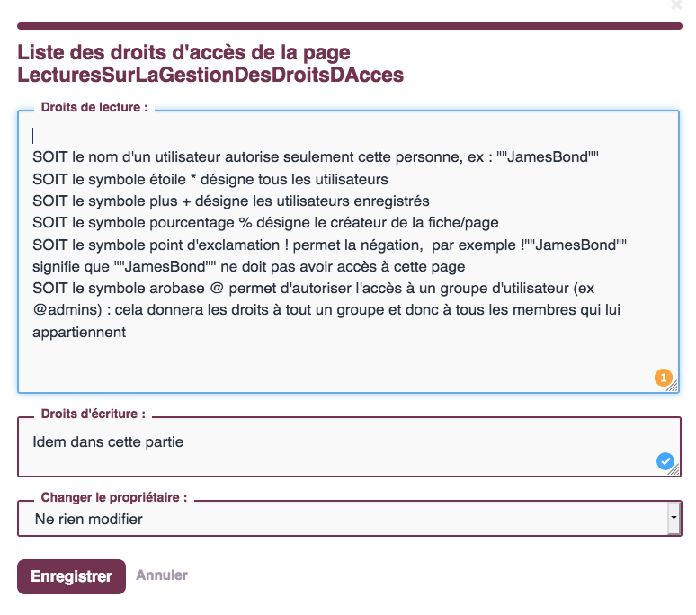
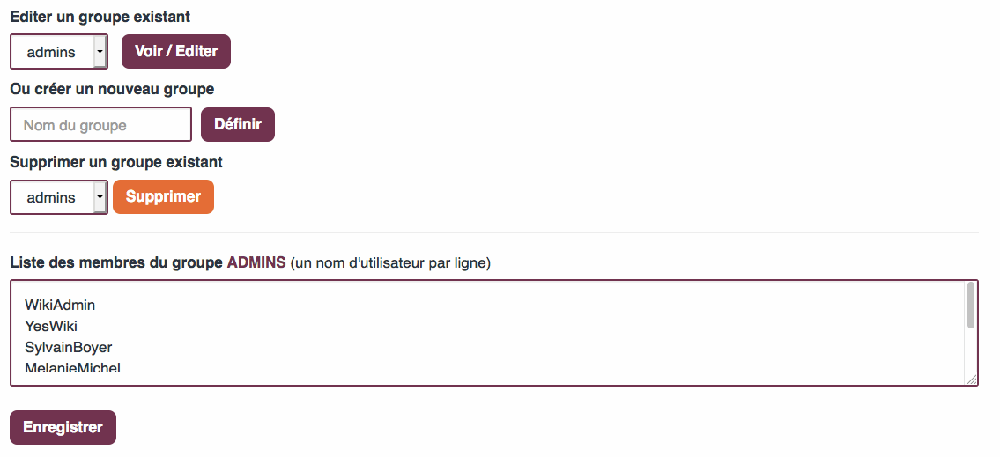
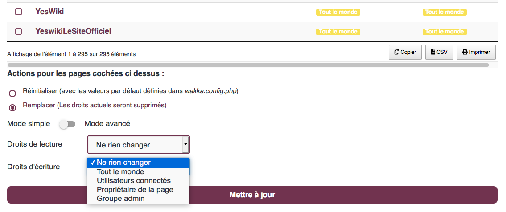
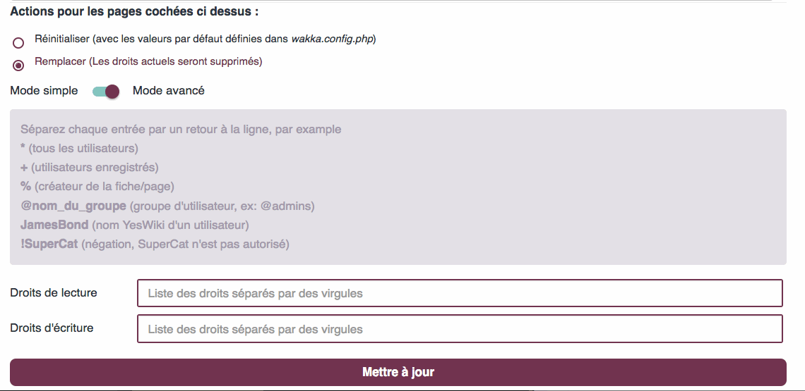
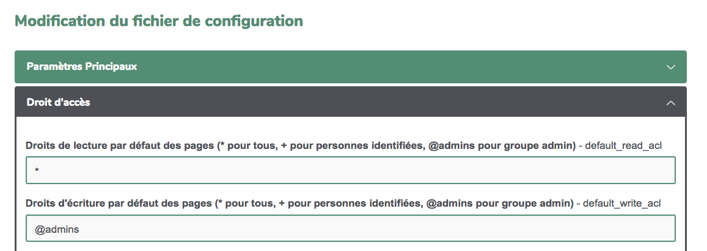
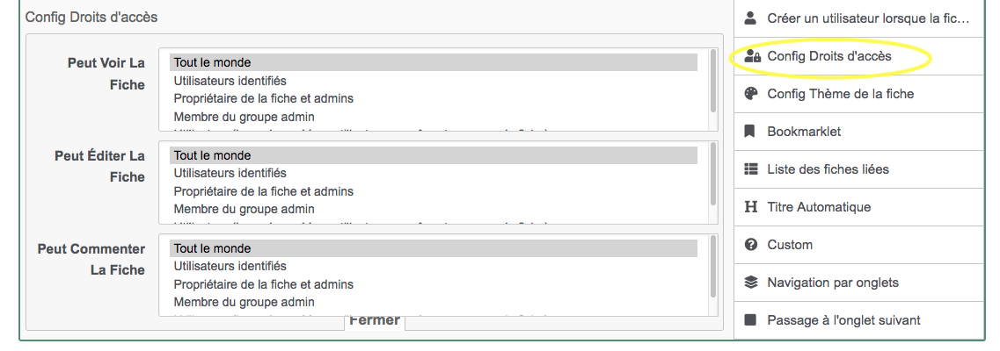
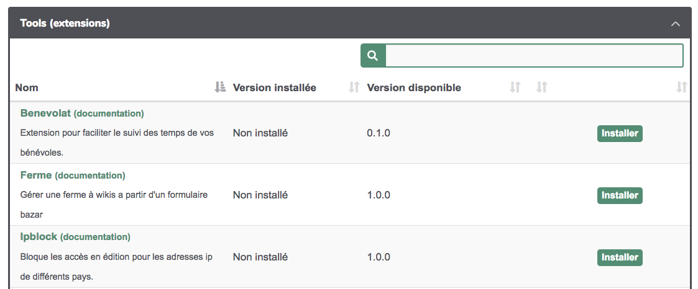

# Administrer son wiki

> Dans cette partie, vous trouverez de nombreuses données pour gérer votre site, notamment la gestion des personnes utilisant le wiki et des droits d'accès, la personnalisation graphique, la gestion du contenu indésirable et les options avancées, la sécurisation du site.

## Gestion du site : plan de l'administration

**Accueil de gestion du site**

Vous avez là un récap des menus et pages spéciales du wiki.

**Droits d'accès**

C'est ici que vous pouvez indiquer "qui a le droit de faire quoi sur quelle page".
Il faut être identifié comme administrateurice pour visionner et modifier les informations de cet espace.

[Voir la rubrique dédiée](/docs/users/fr/admin?id=g%c3%a9rer-les-droits)

**Utilisateurs et groupes**

Ici vous visualisez les comptes utilisateurices créés et vous pouvez les organiser en "groupes".
Il faut être identifié comme administrateurice pour visionner et modifier les informations de cet espace.

[Voir la rubrique dédiée](/docs/users/fr/admin?id=gestion-des-droits-par-utilisateurice-ou-par-groupe)

**Look**

C'est par là que vous personnalisez le squelette et l'esthétique de votre wiki.
Il faut être identifié comme administrateurice pour visionner et modifier les informations de cet espace.

[Voir la rubrique dédiée](/docs/users/fr/admin?id=g%c3%a9rer-le-look)


**Mots clés**

Si vous avez utilisé des mots clés pour qualifier vos pages wiki vous en trouvez un récap ici.
Il faut être identifié comme administrateurice pour visionner et modifier les informations de cet espace.

**Fichier de conf**

Certains éléments de configuration peuvent être personnalisés ici : accès par défaut, sécurité, indexation ...
Il faut être identifié comme administrateurice pour visionner et modifier les informations de cet espace.

**Mises à jour / extensions**

Vous pouvez voir ici la version du wiki et s'il s'agit de la toute dernière.
Si vous êtes identifié.e comme administrateurice vous pouvez faire les mises à jour.

Astuces :
 - mettre à jour YesWiki mais aussi les thèmes et les tools (extensions)
 - une mise à jour se fait en plusieurs étapes : il est nécessaire de cliquer sur "Finaliser la mise à jour (lancer les actions de post-installation)" puis sur "Mettre à jour les pages de gestion"


## Gérer les droits
### Introduction aux droits d'accès

YesWiki a beau être très ouvert lors de son installation (ce qui oblige à amorcer une réflexion sur cette ouverture et se poser quelques questions), il n'en offre pas moins une gestion fine des droits de lecture et d'écriture de son contenu. **Cette gestion permettra :**

*   de limiter l'accès de tout ou partie du wiki à certaines personnes ou catégories de personnes (groupes)
*   de protéger certaines parties (bandeau, menu, footer...) de votre wiki contre les modifications involontaires (ou intempestives)
*   de garder certaines parties de votre wiki cachée (mais pas réellement fermées en accès)

#### Un préalable pour jouer dans les droits d'accès : exister sur le wiki

En effet **seules les personnes ayant un compte sur le wiki peuvent modifier les droits d'accès aux pages et encore avec certaines limites.** La seule personne ayant tous les droits est celle qui a créé le wiki (le super admin). Cette personne peut évidemment partager ses droits avec d'autres utilisateurs du wiki (voir plus bas)

**Il est donc nécessaire de pouvoir se créer un compte sur le wiki ou de se connecter à celui-ci.** Cela s'opère via la roue crantée du wiki / se connecter (ou s'inscrire). En cas de perte du mot de passe, le lien "mot de passe perdu" pourra vous le renvoyer sur le mail indiqué lors de l'inscription.
\=> plus d'infos sur [https://yeswiki.net/?DocumentationIdentification](https://yeswiki.net/?DocumentationIdentification)
  
**Une fois connecté, vous possédez peu de droits** (sauf si l'administrateur du wiki vous en a attribués) à savoir :

*   créer des pages (vu précédemment)
*   vous attribuer la propriété d'une page
*   attribuer des droits d'accès en lecture et écriture sur les pages dont vous êtes propriétaire
*   supprimer les pages dont vous êtes propriétaire

##### Devenir propriétaire d'une page

*   On devient automatiquement propriétaire des nouvelles pages que l'on crée lorsque l'on est connecté sur le wiki (cela se vérifie en bas de page avec la mention propriétaire = vous)
*   Pour devenir propriétaire d'une page sans propriétaire, il suffit de cliquer sur Appropriation (en bas de page) : se faisant, vous recevez des droits de gestion sur cette page (même si ça ne se voit pas comme ça)
*   On ne peut devenir propriétaire d'une page qui a déjà un propriétaire, mais le propriétaire lui-même peut décider de vous nommer nouveau propriétaire de cette page. Si vous avez reçu des droits d'administrateurice sur le wiki, vous pourrez devenir propriétaire de n'importe quelle page sans l'accord du propriétaire !

##### Supprimer une page dont vous êtes propriétaire

Lorsque vous êtes propriétaire d'une page, un bouton "supprimer" apparaît en bas de page. Il vous permettra de supprimer définitivement la page et son historique (attention, c'est sans retour d'où le message de confirmation !).
Si vous avez reçu des droits d'administrateurice sur le wiki, vous pourrez modifier toutes les pages, y compris celles dont vous n'êtes pas propriétaire.

##### Modifier les droits d'une page dont vous êtes propriétaire

En bas de page, vous allez trouver un bouton "permissions". En cliquant sur celui-ci, une fenêtre pop-up va vous permettre de gérer les droits en lecture et écriture.

**Voici les possibilités qui vous sont offertes**



**Cette gestion page par page et user par user est vite "pesante"**

**Pour dépasser cette lourdeur,**

*   un module de gestion des droits des utilisateurs par groupe a été créé
*   un module de gestion du droit d'accès aux pages en masse a été créé


### Gestion des droits par utilisateurice ou par groupe

La gestion utilisateur par utilisateur est très fine MAIS présente quelques inconvénients :

*   lorsque vous avez limité l'accès de plusieurs pages à un utilisateur et qu'un nouvel utilisateur doit recevoir les mêmes accès, vous voilà bon à repasser sur chaque page pour y ajouter son nom ;-(
*   idem dans l'autre sens, si un utilisateur doit "perdre" ses droits d'accès

**Pour s'affranchir de ces limites, la notion de groupe a été introduite.**
Un groupe reprend un ou plusieurs utilisateurs wiki. Il se nomme @nomdugroupe.
Un seul groupe existe par défaut sur le wiki @admins et contient par défaut un seul utilisateur à savoir celui qui a créé le wiki.
Ce groupe @admins a TOUS les droits sur TOUTES les pages du wiki.
C'est un groupe "sensible" donc car les utilisateurs qui s'y trouvent ont des pouvoirs importants sur le wiki et notamment des pouvoirs de suppression (de pages, de formulaires bazar, de listes...) avec des effets potentiellement complexes à "rattraper". Il faut donc être vigilant avec les utilisateurs que l'on va placer dans ce groupe.

Il est possible de créer autant d'autres groupes que souhaité.
**Ces autres groupes n'ont aucun privilège sur le wiki**. Ils sont simplement un regroupement d'utilisateurs. Ce regroupement, ce groupe (@poule, @coq, @...) pourra être utilisé dans la gestion des droits des pages du wiki comme on le ferait pour un utilisateur (on mettra le nom du groupe plutôt que le nom de l'utilisateur).
Ce faisant, si un utilisateur (membre du groupe @coq) quitte le projet et ne doit plus pouvoir modifier les pages auxquelles il avait accès en écriture, il ne faut pas repasser sur chaque page concernée mais il suffira de l'enlever du groupe @coq.
  
Pour gérer les groupes (et les utilisateurs inclus), cela se passe sur la page "utilisateurs et groupes" accessible via la roue crantée / gestion du site (attention, il faut faire partie des administrateurs du wiki pour pouvoir modifier, créer, supprimer des groupes)

**Voici à quoi ressemble la page**

*   pour voir le contenu des groupes : je choisis dans la liste et clique sur "voir/éditer"
*   pour créer un nouveau groupe : j'indique son nom et clique sur "définir"
*   pour supprimer un groupe (attention) : je choisis et clique sur "supprimer"

Pour info : en bas de cette page, vous découvrez et gérez (si vous êtes dans le groupe @admins) les utilisateurs connus du wiki.


**Pour ajouter ou retirer un utilisateur d'un groupe**
Lorsque j'ai cliqué sur "voir/éditer" le groupe concerné, il me suffit dans la case qui apparaît d'indiquer (ou de retirer) le nomwiki de l'utilisateur sur une ligne (sans virgule) et d'enregistrer.



### Gestion des droits des pages en masse

La gestion page par page c'est sympa mais quand on a 150 pages dans son wiki... ça peut vite devenir très long. Heureusement, il existe une page permettant de gérer les changements des droits d'accès de plusieurs pages (toutes les pages) en même temps.
  
Cette page se nomme "Droits d'accès aux pages" et est accessible via la roue crantée / gestion du site. (attention, il faut faire partie des administrateurs du wiki pour avoir accès à cette page)

Sur cette page, vous pourrez aussi voir les droits qui sont attribués à chacune des pages du wiki et pourrez cocher les pages qui doivent être modifiées et attribuer en bas les nouveaux droits en utilisant :

##### en mode simple

via les listes déroulantes proposées (droit de lecture, droit d'écriture)



##### en mode avancé

via les champs classiques (ceux qu'on retrouve quand on édite les droits d'une page seule)



### Gérer les droits d'accès des pages non encore existantes

La gestion vue jusque maintenant permet de gérer l'existant mais comment gérer ce qui va s'ajouter au wiki ?

#### En ce qui concerne les pages

*   soit en le faisant au fur et à mesure via les méthodes présentées ci-dessus
    *   méthode la plus courante (mais franchement pas pratique et fastidieuse)
*   soit en attribuant des droits par défaut à toutes les nouvelles pages créées
    *   Pour ce faire, il faut aller dans la roue crantée/gestion du site/fichier de conf
        *   dans l'accordéon "droit d'accès" vous pouvez déterminer quelles seront les accès par défaut des prochaines pages



Pour le détail, voir la partie [droit d'accès de la page Fichier de configuration](docs/users/fr/admin?id=droit-d39accès)

#### En ce qui concerne les fiches bazar

Assez souvent, la contribution sur les wikis se passe via des formulaires.
Par défaut, ces fiches sont ouvertes en lecture et écriture.
**On peut limiter totalement ou partiellement l'accès aux fiches ou à certaines parties des fiches.**
Cela se réalise lors de la construction du formulaire via certains paramètres.
  
Pour chaque champ de votre formulaire, vous pouvez décider des accès en lecture et écriture afin :

*   de déterminer qui peut remplir ce champ (donc la visibilité de celui-ci en mode "saisie")
*   de déterminer qui peut voir ce champ une fois la fiche existante


Vous pouvez aussi décider d'attribuer "par défaut" des droits particuliers à la fiche entière afin :

*   qu'elle ne soit visible QUE par tel ou tel groupe d'utilisateurices
*   qu'elle ne soit modifiable QUE par tel ou tel groupe d'utilisateurices

Cette gestion s'effectue via le champ "configurer les droits d'accès" de votre formulaire



### Configurer les accès à certaines parties au sein même des pages
Il est donc possible de limiter les accès en lecture et/ou écriture aux pages du wiki.
**Mais pourrions-nous limiter les accès à certaines parties des pages ?**

Et oui !

Lorsque l'on construit sa page wiki, on utilise souvent les composants.
La plupart de ces composants proposent dans leurs paramètres avancés, des choix permettant de limiter leur visibilité aux seuls utilisateurices autorisées.
*   dans le cas d'un bouton (ou d'un onglet), vous pouvez le cacher aux utilisateurices qui n'ont pas reçu les droits d'accès vers la page vers laquelle ce bouton pointe.
*   dans le cas d'une section, vous pouvez déterminer par qui elle sera "visible"
*   ...

Ces opérations sont aussi réalisables pour les différents champs d'un formulaire (nous verrons ça la semaine prochaine).

### Éditer les droits d'accès aux actions
(à trouver ou écrire ET à déplacer pour alléger cette section)

### Éditer les droits d'accès aux handlers
(à trouver ou écrire ET à déplacer pour alléger cette section)

## Gérer le look
L'onglet [Look](/?GererThemes)  accessible via le menu "Gestion du site" permet de :
 - [créer une configuration graphique personnalisée (variante de couleur et de police)](/docs/users/fr/admin?id=cr%c3%a9er-une-configuration-graphique-personnalis%c3%a9e)
 - [ajouter du code CSS personnalisé](/docs/users/fr/admin?id=ajouter-du-code-css-personnalis%c3%a9)
 - [visualiser/modifier le thème graphique affecté à chaque page](/docs/users/fr/admin?id=visualisermodifier-le-th%c3%a8me-graphique-affect%c3%a9-%c3%a0-chaque-page-de-votre-wiki)
 - [modifier le thème par défaut](/docs/users/fr/admin.md#configuration-graphique-par-d%C3%A9faut)

### Créer une configuration graphique personnalisée
Le thème Margot permet de définir des variantes de couleur pour votre wiki : [Configuration graphique](/?LookWiki)
L'interface vous permet de modifier les couleurs utilisées dans le thème : couleur primaire, couleur secondaire 1, couleur secondaire 2, couleur de texte, couleur neutre , couleur claire (fond) - puis de nommer cette configuration custom et la sauvegarder.
La configuration personnalisée pourra être appliquée à l'ensemble du site ou à certaines pages selon vote besoin.

#### Astuce 
Si vous choisissez une police différente, 2 solutions possibles :
- installer l'extension **fontautoinstall** qui permet d'ajouter sur votre serveur la police choisie (l'extension doit être activée avant de créer la configuration graphique)
- copier vos polices sur votre serveur dans le dossier /custom/fonts puis modifier PageCss pour ajouter le chargement des polices

Exemple
```
/* Typo utilisée ubuntu-regular - latin */
/* ubuntu-regular - latin */
/* ubuntu-mono-700 - latin */
@font-face {
    font-family: 'Ubuntu Mono';
    font-style: normal;
    font-weight: 700;
    src: url('custom/fonts/ubuntu-mono-v10-latin-700.eot'); /* IE9 Compat Modes */
    src: local(''),
        url('custom/fonts/ubuntu-mono-v10-latin-700.eot?#iefix') format('embedded-opentype'), /* IE6-IE8 */
        url('custom/fonts/ubuntu-mono-v10-latin-700.woff2') format('woff2'), /* Super Modern Browsers */
        url('custom/fonts/ubuntu-mono-v10-latin-700.woff') format('woff'), /* Modern Browsers */
        url('custom/fonts/ubuntu-mono-v10-latin-700.ttf') format('truetype'), /* Safari, Android, iOS */
        url('custom/fonts/ubuntu-mono-v10-latin-700.svg#UbuntuMono ') format('svg'); /* Legacy iOS */
}
:root {
--main-title-fontfamily: 'Ubuntu Mono', sans-serif;
}
```


### Ajouter du code CSS personnalisé
Il est possible d'ajouter du code CSS personnalisé sur une page wiki dédiée : PageCss.
Cette page ne doit contenir que du CSS. Il sera chargé en dernier afin de pouvoir surcharger des classes CSS et personnaliser l'affichage.
Par défaut, cette page contient des variables CSS qui sont utilisables avec le thème Margot. Vous pouvez ajouter tout code CSS qui vous sera utile.
```
:root { 
/* couleurs des titres */
  --title-h1-color:var(--neutral-color);
  --title-h2-color:var(--primary-color);
  --title-h3-color:var(--secondary-color-1);
  --title-h4-color:var(--secondary-color-2);

/* couleur pour les messages positifs par défaut vert */
 --success-color: #3cab3b; 

/* couleur pour les messages d'erreur par défaut rouge */
 --danger-color: #d8604c;  

/* couleur pour les messages d'alerte par défaut orange */ 
 --warning-color: #D78958; 

/* couleur de fond de la partie centrale votre wiki */
 --main-container-bg-color:var(--neutral-light-color);

/* couleur des liens */
 --link-color: var(--primary-color);  

/* couleur des liens au survol */
 --link-hover-color: var(--primary-color);  

/* couleur de la barre de menu */
 --navbar-bg-color: var(--primary-color); 
 --navbar-text-color: var(--neutral-light-color); 
 --navbar-link-color: var(--neutral-light-color); 
 --navbar-link-bg-color: transparent; 
 --navbar-link-hover-color: rgba(255,255,255,0.85); 
 --navbar-link-bg-hover-color: transparent; 
 --navbar-border: none; 
 --navbar-border-radius: 0; 
 --navbar-shadow: none; 
 
 --header-bg-color: var(--neutral-light-color);
 --header-text-color: var(--neutral-color); 
--header-title-color: var(--primary-color); 

/* couleur de fond du pied de page */
 --footer-bg-color: transparent; 
 --footer-text-color: var(--main-text-color); 
 --footer-title-color: var(--main-text-color); 
 --footer-border-top: 3px solid var(--neutral-soft-color); 

 --btn-border: none; 
 --btn-border-radius: .5em; 
 --checkbox-color: var(--primary-color); 

 } 
```


### Visualiser/modifier le thème graphique affecté à chaque page de votre wiki
Il est possible d'affecter un style différent à certaines pages wiki (par exemple pour différencier une partie intranet).
La page Look permet de cocher les pages concernées puis sélectionner le thème et affecter un nouveau thème graphique.

Le choix du thème peut également se faire page par page (pour l'instant, utiliser cette méthode pour sélectionner un preset pour une page seulement)
**Pour modifier ces éléments sur une page (précédemment créée ou nouvelle) :**
- Passer en mode édition (double clic ou "éditer la page")
-En bas de votre page, apparait un gros bouton Thème graphique :

### Configuration graphique par défaut
Pour **changer le thème graphiques sur l'ensemble du site**, reportez-vous à la rubrique "Gérer le thème par défaut du wiki" en bas de la page [Look](/?GererThemes)
Ce changement aura pour effet de mettre à jour le fichier de configuration wakka.config.php et rajouter les valeurs:

'favorite\_theme' => 'nom du thème correspondant au nom du sous-répertoire thème correspondant à ce thème personnalisé',
'favorite\_squelette' => 'nom du squelette en liaison avec le thème personnalisé.tpl.html',
'favorite\_style' => 'nom de la feuille de style en liaison avec le thème personnalisé.css'


### Dossier custom

Il est possible de créer un thème personnalisé ou d'en personnaliser une partie seulement.
- pour un template de thème graphique  :
        1. identifier le fichier. Par exemple :  ''' /themes/margot/squelettes/1col.tpl.html'''

        (“margot” est le nom de dossier du thème utilisé)
        2. le copier dans le dossier :    ''' /custom/themes/margot/squelettes/1col.tpl.html'''


### Ajouter des thèmes graphiques

#### Importer un thème graphique pré-existant

*Cette partie concerne les bidouilleurs confirmés.*

**Pour installer un nouveau thème graphique** :

*   Récupérer le fichier compressé (par exemple depuis [la liste disponible sur le site de Yeswiki](https://yeswiki.net/?TelechargementTemplates))
*   Le dé-compresser
*   L'envoyer par ftp dans votre yeswiki, dans le dossier "thèmes" /theme .

**Pour installer une nouvelle image de fond** :

*   L'envoyer par ftp dans files/backgrounds.

Seuls 2 formats d'images sont acceptés :

*   .jpg pour les images de fond pleine page (limiter la résolution à moins de 1920x1080 pixels pour éviter des temps de chargement trop longs)
*   .png pour les images en mosaïque (répétées sur l'axe horizontal et vertical)

Le thème et l'image de fond seront alors accessibles (en étant connecté sur votre wiki en mode édition) grâce au bouton "Thème graphique"

Pour définir une configuration graphique par défaut se rendre sur la partie "[Changer de thème graphique](https://yeswiki.net/?DocumentationChangerThemeGraphique)"

### Modifier un thème graphique pré-existant

Modifier un thème graphique revient à modifier :

*   Les squelettes : ils se trouvent dans le répertoire "themes/squelettes" d'un thème graphique donné
*   La feuille de style : elle se trouve dans le répertoire "themes/styles"
*   Les images de fond : elles se trouvent dans le répertoire "/files/backgrounds"

L'architecture de YesWiki est basée sur [Bootstrap](https://fr.wikipedia.org/wiki/Twitter_Bootstrap). Pour modifier les thèmes graphiques et squelettes de YesWiki, il convient de maîtriser cette bibliothèque libre de mise en forme.

Modifier le thème graphique va donc revenir à adapter un squelette en modifiant celui-ci avec la syntaxe Bootstrap adaptée et la feuille de style associée.


#### créer des mises en page plus fines
à écrire :
mermaid / Izmir / bootstrap / markdown

Après avoir inséré une image, il est à nouveau possible de la modifier. Plus de paramètres sont alors proposés, notamment l'effet Izmir dans les paramètres avancés.


## Suivre la vie de son wiki

### Via la page tableau de bord

Une page TableauDeBord accessible dans le menu "roue crantée". Il permet d'accéder aux :

*   derniers comptes utilisateurs créés
*   dernières pages modifiées
*   dernières pages commentées
*   un index de toutes les pages du Wiki

### Via la page DerniersChangements
Sur cette page, vous verrez toutes les pages modifiées du wiki.

### Via les flux rss du wiki
Plusieurs flux RSS sortent du wiki :
 - L'ensemble des changements du wiki
     - ce flux est accessible via la page DerniersChangementsRSS/xml de votre wiki
 - les modifications de chacun des formulaires
      - ces flux sont accessibles via la page "base de données" de la roue crantée

### Recevoir le contenu d'une page par courriel

## Lutter contre le spams

Hélas, comme la plupart des wikis ouverts (MediaWiki, DokuWiki), YesWiki n'échappe pas aux attaques de quelques ~~emmerdeurs~~ référenceurs soit-disant professionnels et autres robots de spam, qui polluent les contenus des pages.

### Les symptômes : comment identifier les spams ?

*   Vous pouvez découvrir sur une ou plusieurs pages des liens vers des sites externes qui semblent sans rapport avec l'objet du wiki _(qui vendent des robes de mariée, des sites indonésiens sans rapport, des liens commerciaux vers la loi Duflot, des textes en langue étrangère, etc..)_
*   Il se peut aussi que de nouvelles pages soient créées, et dans certains cas de nouveaux utilisateurices wikis.

Dans tous les cas, il sera toujours possible de faire marche arrière, et les informations sensibles d'accès ftp ou mysql à votre serveur ne peuvent pas être trouvées comme cela.

### Les 10 conseils anti-spam

- **1.** Je consulte régulièrement mon wiki
- **2.** Je m'abonne à son flux RSS [voir plus bas / suivre la vie de mon wiki](#Suivre-la-vie-de-son-wiki)
- **3.** Je consulte la page TableauDeBordDeCeWiki de mon wiki (accessible depuis la "roue crantée")
- **4.** Je vérifie les dernières pages modifiées dans le TableauDeBord ou sur la page DerniersChangements
- **5.** Je vérifie les derniers comptes crées sur la page TableauDeBord. (Action {{Listusers last="20"}} )
- **6.** J'édite les pages en question et je supprime les parties indésirables, puis je sauve. (Cela prend moins d'une minute)
- **7.** Je protège l'accès en écriture des pages spéciales du wiki (menu, roue crantée, footer...)
- **8.** Je maintiens mon wiki à jour
- **9.** Pour les plus endurcis, je fais le grand ménage avec l'outil despam (voir plus bas)
- **10.** Je ne cède pas à la tentation de transformer mon espace collaboratif en bunker. Et je continue à mettre en balance les effets positifs de l'intelligence collective.

### Que faire si vous avez du spam ?

#### Réparer une page spéciale spammée

_Tiens, ce matin, en me baladant sur un de mes YesWiki j'ai découvert que j'avais été spammé avec un bel écran bizarre à la place de ma page d'accueil et impossible de pouvoir modifier quoique ce soit !_

##### Si votre wiki est ouvert en écriture:

1. Identifier la page spammée en ajoutant le handler /editiframe aux pages spéciales : "BazaR", "GererSite", "GererDroits", "GererThemes", "GererMisesAJour", "GererUtilisateurs", "GererDroitsActions", "GererDroitsHandlers", "TableauDeBord", "PageTitre", "PageMenuHaut", "PageRapideHaut", "PageHeader", "PageFooter", "PageCSS", "PageMenu", "PageColonneDroite", "MotDePassePerdu", "ParametresUtilisateur", "GererConfig", "ActuYeswiki", "LookWiki"    
2. Dès que le code malicieux est repéré, supprimer ce code et sauvegarder la page.
3. Revenir sur la liste des versions de cette page pour éditer la version avant l'apparition du code malicieux et remettre en place le contenu précédent.

##### Si votre wiki est fermé en écriture

Il peut être impossible de se connecter au wiki (la roue crantée n'apparaît pas). Ceci peut être contourné en utilisant ce lien sans afficher les pages spéciales avec l'url : https://www.example.com/?PageLogin/iframe
Toutefois, si la page n'existe pas encore, alors il faut tenter : https://www.example.com/?PageLogin/editiframe pour simuler la création de la page ce qui fera apparaître la page de connexion.

#### Utiliser les paramètres de contrôle d'accès via le wakka config ou la page ["Fichier de conf"](/docs/users/fr/admin?id=droit-d39accès)

1. A partir du fichier wakka.config.php accessible via FTP, il est possible :

*   d'ajouter un capcha en mode édition
*   d'ajouter un champ (mot de passe) en entrée du mode édition (+ un message informatif sur ce mot de passe)

Les paramètres ajoutables au wakkaconfig

    'password\_for\_editing' => 'votremotdepasse',
    'password\_for\_editing\_message' => 'un message qui apparait au dessus du champ mot de passe',
    'use\_hashcash' => true, //ne pas toucher pour l'instant
    'use\_nospam' => true, // ne pas toucher pour l'instant 'use\_alerte' => true,
    'use\_captcha' => true,

2. A partir de la page ["Fichier de conf"](/docs/users/fr/admin?id=droit-d39accès)
Les paramètres ci-dessus sont aussi activables de manière simple via la page de gestion du site, onglet "fichier de conf". Pour le détail, voir la partie ["Fichier de configuration>droits d'accès"](/docs/users/fr/admin?id=droit-d39accès) 

#### Pour les ajouts dans une page isolée

1.  Editer la page en question et supprimer la partie indésirable, puis sauver : cela prend moins d'une minute.

Astuce : assurer une veille à plusieurs personnes, à partir du flux RSS qui sort de votre wiki, est plus efficace.

#### Pour de nouvelles pages indésirables créées

##### Si vous pouvez vous connecter en tant que WikiAdmin :

1.  s'identifier en tant qu'administrateurice du wiki (WikiAdmin par défaut)
2.  éditer les permissions de la page pour mettre le compte [WikiAdmin](https://yeswiki.net/?WikiAdmin) propriétaire de la page
3.  supprimer la page à partir du lien sur la barre d'action en bas de page

##### Si vous ne pouvez pas vous connecter en tant que WikiAdmin :**

1.  éditer la page et remplacer tout le texte de spam par un caractère (il faut au moins un contenu autre qu'un espace dans la page pour la sauver (pour ma part j'utilise ".")


#### Pour limiter la création de nouveaux comptes

Pour éviter que des inconnus puissent se créer des comptes, vous pouvez limiter l'action [UserSettings](https://yeswiki.net/?UserSettings) aux seul.es administrateurices.
Si cela a l'avantage de bloquer/réserver la création de nouveaux comptes aux seuls admin, cela limite vraiment l'autonomie des personnes utilisant votre wiki.

#### Pour supprimer les commentaires indésirables

1.  Ajouter l'action {{erasespamedcomments}} dans la page de votre choix. (Elle n'est accessible qu'aux administrateurices)
2.  Ensuite, cocher les commentaires indésirables et appuyer sur le bouton "Nettoyer"

#### Pour supprimer de nombreuses pages rapidement

Installer l'extension "multideletepages" (Roue crantée > Gestion du site > Mise à jour / extensions).
Puis, dans une page (par exemple créer une page DeletePages) mettre l'action {{multideletepages}}. 
Vous aurez alors un tableau avec la liste de toutes les pages : vous pouvez cocher de nombreuses pages et cliquer sur "Suppr. select." : ATTENTION, ça ne redemande pas de validation.

#### Pour les attaques massives sur de nombreuses pages

Trois options sont possibles :
* option 1 : nettoyer les pages spéciales puis utiliser l'action {{despam}}
* option 2 : restaurer la base de donnée à partir d'une sauvegarde. ATTENTION, pour cette option, il faut avoir une sauvegarde et les accès à phpmyadmin
* option 3 : pour la suppression massive de nouvelles pages : extension multideletepages (cf paragraphe ci-dessus).


#### Pour supprimer les utilisateurs non désirables (utilisateurs avancés)

 - se rendre sur la page [`GererUtilisateurs`](?GererUtilisateurs ':ignore') du wiki, en tant qu'administrateurice
 - supprimer les comptes non désirés en cliquant sur le bouton en fin de ligne. ATTENTION : il n'y a pas de message de confirmation. La suppression est définitive dès le 1er clic réalisé.

#### Activer l'extension Ipblock
Cette extension permet de bloquer l'accès à votre wiki en fontion des adresses IP (et de leur provenance géographique).
Elle s'active via l'onglet Mise à jour / extension de la page gestion du site de votre wiki.
Les paramètres sont alors visibles dans la partie "Blocage d'adresses IP"

#### Fermer l'accès au wiki à certaines adresses IP

Souvent les vagues de spam proviennent d'une région spécifique et on peut s'en préserver via une fermeture des accès aux wikis à ces adresses IP spécifiques (les IP sont spécifiques des régions/pays)

Vous pourrez régler ces détails dans la roue crantée/ gestion du site/ fichier de conf/ blocage d'adresse IP


Il faudra au préalable que vous ayez installé l'extension IP block via roue crantée/gestion du site/mise à jour et extensions



Pour découvrir l'ensemble des stratégies possibles face au spam => [https://yeswiki.net/?LutterContreLeSpam](https://yeswiki.net/?LutterContreLeSpam)


## Fichier de configuration

Cette page permet de modifier la configuration de son Yeswiki sans passer par le fichier wakka.config.php. Dans les versions précédentes de Yeswiki, ces éléments n'étaient accessibles que par FTP, en éditant le fichier wakka.config.php, se trouvant à la racine du dossier du YesWiki. Tous les administrateurices de Yeswiki n'ayant pas accès au serveur, cette page de configuration contourne ce problème. Il faut être identifié comme administrateurice pour visionner et modifier les informations de cet espace.

### Paramètres principaux
 - **Titre de votre wiki - wakka_name** : c'est le titre donné à la création de votre wiki et qui s'affiche, de base, dans la page "PageTitre" et apparaît en haut à gauche sur la page d'accueil. Ce titre sera aussi utilisé par les moteurs de recherche comme titre de votre site. Il peut être modifié à tout moment.
 - **Nom de la page d'accueil - root_page** : à la création du wiki, le nom donné à cette page est "PagePrincipale". Il peut être modifié à tout moment.
 - **Langue par défaut (fr ou en ou ... auto = langue du navigateur) - default_language** : à la création du wiki, la langue choisie est le français. Le fait de modifier ce paramètre modifiera la langue pour les menus et paramètres en mode édition et les pages comme la page de configuration.
 - **Icône du site (emoji ou URL vers une image PNG) - favicon** : ce paramètre permet de modifier l'icône qui apparaît dans l'onglet du navigateur (Chrome, Firefox...)
 - **Activer le mode de debug (yes ou no) - debug** :  ce paramètre active le mode de débogage s'il est passé à la valeur 'yes' (infos sur le nombre de requêtes, le temps écoulé et force l'affichage des erreurs php pour les développeurs). Astuce : on peut aussi passer &debug dans l'url pour debugguer
 - **Fuseau horaire du site (ex. UCT, Europe/Paris, Europe/London, GMT = utiliser celui du serveur,) - timezone** : à la création du wiki, le fuseau horaire choisi est GMT et se cale sur celui du serveur. Cela peut amener des différences d'affichage. Il peut arriver que l'affichage de l'heure de début d'un évènement sur le calendrier soit décalée car la configuration serveur peut être en décalage par rapport au fuseau horaire de l'administrateurice du wiki.
Pour bien configurer, on peut mettre dans le paramètre Fuseau horaire du site la valeur : Europe/Paris (ou sinon UTC).
 - **Méthodes autorisées à être affichées dans les iframes (iframe,editiframe,bazariframe,render,all = autoriser tout) - allowed_methods_in_iframe**
 - **Nombre maximum de versions d'une page affichées par le handler `/revisions`. - revisionscount** : 
 - **Image d'avatar par défaut pour les commentaires (URL vers une image) - default_comment_avatar**
 - **Activer le nettoyage HTML avant sauvegarde. Attention, modifie le contenu à la sauvegarde ! (true ou false) - htmlPurifierActivated**
 
### Droit d'accès
Cette partie permet de modifier les droits d'accès pour les pages à venir. Pour voir d'autres façons de gérer les droits d'accès, voir le paragraphe [Gérer les droits d'accès des pages non encore existantes](/docs/users/fr/admin?id=g%c3%a9rer-les-droits-d39acc%c3%a8s-des-pages-non-encore-existantes)
 - **Droits de lecture par défaut des pages (* pour tous, + pour personnes identifiées, @admins pour groupe admin) - default_read_acl** : par défaut, les pages à venir sont ouvertes à tous en droit de lecture grâce au symbole `*`.Pour limiter la lecture aux personnes ayant créé un compte, il faut mettre le symbole `+`. Pour limiter à un groupe d'utilisateurs en particulier, mettre le symbole `@` et le nom du groupe accolé. Par exemple, pour le groupe admin : `@admins`.
 - **Droits d'écriture par défaut des pages (* pour tous, + pour personnes identifiées, @admins pour groupe admin) - default_write_acl** : par défaut, les pages à venir sont ouvertes à tous en droit d'écriture. 
 - **Droits de commentaires par défaut des pages (comments-closed pour fermés, * pour tous, + pour personnes identifiées, @admins pour groupe admin) - default_comment_acl** :
 - **Commentaires activés (true ou false) - comments_activated** : 
 - **Mot de passe demandé pour modifier les pages (voir doc gestion des spams) - password_for_editing** : ce paramètre permet de demander un mot de passe AVANT de rentrer en mode édition que ce soit pour les pages wiki ET les fiches bazar. Si vous êtes connectés, ce mot de passe ne vous est pas demandé. Exemple : pour entrer dans le mode édition, les utilisateurices doivent entrer le chiffre `6` et un message informatif leur apporte une précision pour noter ce mot de passe.
 - **Message informatif pour demander le mot de passe (voir doc gestion des spams)** - password_for_editing_message : ce paramètre permet d'indiquer un message afin de donner aux personnes usagères une info sur le mot de passe à rentrer (on fait le pari que les turcs spammers ne le liront pas ;-) exemple :`Pour éviter les attaques de spam, merci d'indiquer en chiffre combien font t.rois fois 2...`
La combinaison des deux paramètres donnent le résultat suivant pour l'exemple :


 - **Autoriser le double-clic pour éditer les menus et pages spéciales (true ou false) - allow_doubleclic** : par défaut, le double-clic utilisé pour l'édition des pages a été retiré pour les menus et les pages spéciales (PageMenuHaut, PageTitre, PageRapideHaut) afin d'éviter que ces pages soient spammées. Pour autoriser ce double-clic, mettre `true`pour ce paramètre.

### Envoi des e-mails
 - **Remplacer le mail utilisé comme expéditeur des messages - contact_from** :
 - **Message personnalisé des mails envoyés depuis l'action contact - mail_custom_message** :
 - **Ajouter 'wiki=' aux liens vers ce wiki dans les e-mails - contact_use_long_wiki_urls_in_emails** :
 
### Barre d'édition pour les pages et les champs texte
 - **Nom du champ bazar texte long pour lequel les composants doivent être visibles - actionbuilder_textarea_name** :
 
### Insertion de médias (images, vidéos)
 - **Service de vidéo par défaut (peertube, youtube ou vimeo) - attach-video-config[default_video_service]** :
 - **Adresse du serveur peertube par défaut - attach-video-config[default_peertube_instance]** :
 
### Base de données

Par défaut, pour l'affichage des données sous forme cartographique, les cartes sont centrées sur le centre de la France et affiche l'intégralité de la France. On peut forcer le centre ailleurs en configurant les paramètres ci-dessous.

 - **Latitude par défaut des affichages cartographiques - baz_map_center_lat** : par défaut, la latitude pour centrer la carte sur le centre de la France est 46.22763.
 - **Longitude par défaut des affichages cartographiques - baz_map_center_lon** : par défaut, la longitude pour centrer la carte sur le centre de la France est 2.213749
 - **Niveau de zoom par défaut des cartes (1:monde => 15:commune) - baz_map_zoom** : par défaut, pour afficher l'intégralité de la France, le niveau de zoom est à 5. L'échelle de zoom va de `1`(vue de l'ensemble du monde) à `15`(vue d'une commune)
 - **Hauteur par défaut en pixels des affichages cartographiques - baz_map_height** : par défaut, la valeur est de 300px.
 - **Adresse mail de l'expéditeur des modifications des fiches bazar - BAZ_ADRESSE_MAIL_ADMIN** :
 - **Envoyer un mail aux admininistrateurs à chaque modification de fiche (true ou false) - BAZ_ENVOI_MAIL_ADMIN** :
 - **Temps (s) entre deux rafraîchissements du cache pour vérifier les ajouts et modifications dans les requêtes JSON - baz_external_service[cache_time_to_check_changes]** :
 - **Temps (s) entre deux rafraîchissements du cache pour vérifier les suppresions dans les requêtes JSON - baz_external_service[cache_time_to_check_deletion]** :
 - **Temps (s) entre deux rafraîchissements du cache pour formulaires nécessaires aux requêtes JSON - baz_external_service[cache_time_to_refresh_forms]** :
 - **Permettre la création de fiches même si le wiki est fermé en écriture (true ou false) - bazarIgnoreAcls** : 

### Sécurité
 - Prévenir si l'on quitte la page sans sauvegarder (true ou false) - use_alerte
 - Activer l'utilisation d'un captcha avant la sauvegarde (true ou false) - use_captcha
 - Activer l'antispam hashcash du wiki (activé par défaut) - use_hashcash
 - État du wiki (running ou vide = standard, hibernate = lecture seule) - wiki_status
### Balises meta pour l'indexation web
 - **Mots clés pour le référencement (séparés par des virgules, pas plus de 20-30) - meta_keywords** : ce paramètre permet d'ajouter des mots-clés pour améliorer le référencement sur les moteurs de recherche. Les mots doivent être séparés par une virgule et il ne faut pas dépasser 20 à 30 mots.
 - **Description du site en une phrase, pour le référencement (Attention : ne pas mettre de "." (point)) - meta_description** : La phrase rédigée sera utilisée par les moteurs de recherche pour la description succincte du site. Ne pas mettre de point à la fin de la phrase.
 - **Empêcher les robots à indexer le wiki (Mettre 'noindex,nofollow,noarchive,noimageindex') - meta[robots]** : si le site wiki est utilisé, par exemple, en tant qu'intranet pour un groupe de personne bien défini, il est possible d'empêcher l'indexation du site sur les moteurs de recherche en précisant dans ce paramètre `noindex,nofollow,noarchive,noimageindex`


## Sauvegardes

Il est possible de réaliser une sauvegarde complète ou partielle de votre YesWiki en vous rendant dans la page [`GererSauvegardes`](?GererSauvegardes ':ignore') de votre site (aussi accessible en passant par [`GererSite`](?GererSite ':ignore') > `Sauvegardes`).

Comme les configurations de serveurs peuvent être très différentes d'un site à l'autre, il est peut-être nécessaire de réaliser quelques réglages au préalable pour que ça fonctionne.

### Erreur de sauvegarde : sauvegarde déjà en cours

Si lors de la sauvegarde, vous avec un message comme quoi "une sauvegarde est déjà en cours", alors que vous êtes sûrs que ça n'est pas le cas, ceci peut être dû à un arrêt brutal d'une sauvegarde avant que YesWiki est pu remettre à jour le statut du site.

Pour résoudre ce souci, il vous suffit d'appliquer les instructions du paragraphe suivant _"site en hibernation"_.

### Erreur de sauvegarde : site en hibernation

Si lors de la sauvegarde, vous avec un message comme quoi le site est en "hibernation" :

 1. Vérifiez qu'aucune autre sauvegarde est en cours et que le site doit bien être sorti d'hibernation auprès de votre communauté
 2. Rendez-vous dans la page [`GererConfig`](?GererConfig ':ignore') de votre site (aussi accessible en passant par [`GererSite`](?GererSite ':ignore') > `Fichier de conf`).
 3. Rendez-vous dans la partie `Sécurité`
 4. Recherchez le paramètre `wiki_status` (état du wiki)
 5. pour se paramètre, videz le champ puis sauvegardez en cliquant sur `Valider` en bas de la page
 6. revenir vérifier que le champ est vide (ou qu'il vaut bien `running`)
 7. revenir à la page [`GererSauvegardes`](?GererSauvegardes ':ignore') pour relancer votre sauvegarde

### Erreur de sauvegarde : dossier de sauvegarde non accessible en écriture

Si lors de la sauvegarde, vous avec un message comme quoi "dossier de sauvegarde n'est pas accessible en écriture" :

 1. Rendez-vous dans la page [`GererConfig`](?GererConfig ':ignore') de votre site (aussi accessible en passant par [`GererSite`](?GererSite ':ignore') > `Fichier de conf`).
 2. Rendez-vous dans la partie `Sécurité`
 3. Recherchez le paramètre `privatePath` (Localisation des sauvegardes)
   - si ce paramètre contient le checmin d'un dossier de votre serveur, vérifiez que ce dossier existe bien et que l'environnement `php` du site internet a les droits d'écriture pour ce dossier.
   - si le paramètre est vide, vous pouvez le remplir avec le chemin d'un dossier de votre serveur (Pour une adresse relative par rapport au dossier de base de votre serveur, na pas commencer par `/`). Ce chemin ne doit pas être accessible depuis internet
   - si vous souhaitez conserver le paramètre avec une valeur vide, ce sera la dossier `private/backups/` qui sera utilisé. Pensez-bien à le rendre non accessible depuis internet;
   - il est possible d'utiliser la valeur `%TMP` pour que les sauvegardes se fassent dans le dossier temporaire du serveur

### Erreur de sauvegarde : lancement impossible des commandes console sur le serveur

Le système de sauvegarde de YesWiki utilise des commandes console sur le serveur pour faire les sauvegardes.
Ceci permet d'exécuter les tâches en arrièrre plan et éviter les déconnexios intempestives pendant la sauvegarde (surtout quand elle est longue).

Certaines restrictions de sécurité de votre serveur peuvent empêcher l'utilisation de ctte fonctionnalité. Pour résoudre ce souci, vous pouvez :
 - Vérifier dans votre interface de gestion de votre serveur si les commandes `exec`, `proc_open`, `proc_terminate` ... sont autorisées pour `php`
 - OU passez en mode synchrone :
   1. Rendez-vous dans la page [`GererConfig`](?GererConfig ':ignore') de votre site (aussi accessible en passant par [`GererSite`](?GererSite ':ignore') > `Fichier de conf`).
   2. Rendez-vous dans la partie `Sécurité`
   3. Recherchez le paramètre `call_archive_async` (Lancer les opérations de sauvegardes en arrière-plan)
   4. Mettez `false` pour ce paramètre
   5. Sauvegardez en cliquant sur `Valider` en bas de la page
   6. Vérifier que la valeur a bien été enregistrée puis revenez lancer votre sauvegarde

**Important, en mode `synchrone`, si la sauvegarde est plus longue que le réglage de temps maximum de connexion de votre serveur, alors elle peut ne pas se terminer.** Il faudra alors choisir un sous-ensemble plus petit de votre site pour que la sauvegarde se fasse plus rapidement que la limite de temps de connexion de votre serveur.

### Erreur de sauvegarde : mysqldump inaccessible

Pour réaliser des sauvegardes de votre site, YesWiki utilise l'utilitaire `mysqldump`.

Sur certains serveurs, cet `utilitaire` n'est pas accessible à `php` par défaut. YesWiki utilise des méthodes alternatives pour contourner ce souci mais dans certains cas, les méthodes alternativent ne suffisent pas.

Essayer de voir si vous pouvez rendre accessible `mysqldump` sur votre serveur.

Si le problème persiste, veuillez le signaler à [l'équipe bénévole YesWiki](https://forum.yeswiki.net/c/support) pour qu'elle essaye de corriger le point bloquant.

### Erreur de sauvegarde : dossier de sauvegarde accessible sur internet

Si votre dossier de sauvegarde est accessible sur internet, il ne sera pas possiblede lancer la sauvegarde. Ceci est uns restriction pour éviter les fuites de données depuis les fichiers de sauvegardes.

Pour corriger ceci:
 1. Rendez-vous dans la page [`GererConfig`](?GererConfig ':ignore') de votre site (aussi accessible en passant par [`GererSite`](?GererSite ':ignore') > `Fichier de conf`).
 2. Rendez-vous dans la partie `Sécurité`
 3. Recherchez le paramètre `privatePath` (Localisation des sauvegardes)
 4. Notez la valeur de ce paramètre (s'il est vide, considérez qu'il vaut `private/backups`)
 5. Vérifier que ce dossier n'est pas accessible depuis internet avec votre configuration de serveur
   - si le dossier est un sous-dossier de votre site internet, vous devez configurer votre serveur pour restreindre l'accès :
     - soit en créant un fichier `.htaccess` dans le dossier concerné et en mettant `DENY FROM ALL` dans ce fichier
     - soit en configurant votre logiciel http (`apache`, `nginx`, ...) pour qu'il interdise l'accès internet à ce dossier